# Simple Calculator

## 개요

* C#을 활용하여 사칙연산 기능을 수행하는 계산기 프로그램을 구현하였다.

* 사용자 입력을 기반으로 숫자를 입력받고 연산 결과를 출력하도록 구성하였다.

* 사용한 플랫폼:
  C#, .NET Windows Forms, Visual Studio, GitHub

* 사용한 컨트롤:
  TextBox, Button, Label

---

## 실행 화면 (과제1)

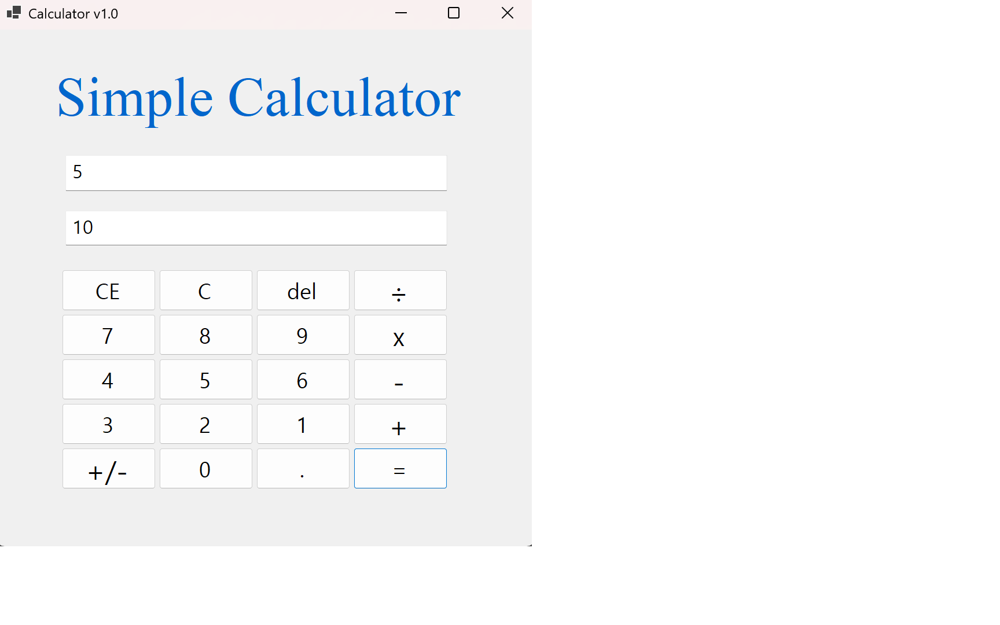

* 과제 내용
  숫자 입력 및 덧셈 기능 구현

* 구현 내용과 기능 설명
  숫자 버튼 클릭 시 입력창에 값이 누적되도록 구현하였다.
  공통 이벤트를 사용하여 코드의 중복을 줄였다.
  더하기 버튼 클릭 시 첫 번째 값을 저장하고 입력창을 초기화하도록 구성하였다.
  = 버튼 클릭 시 두 번째 값을 입력받아 덧셈 연산을 수행하고 결과를 출력하였다.

---

## 실행 화면 (과제2)

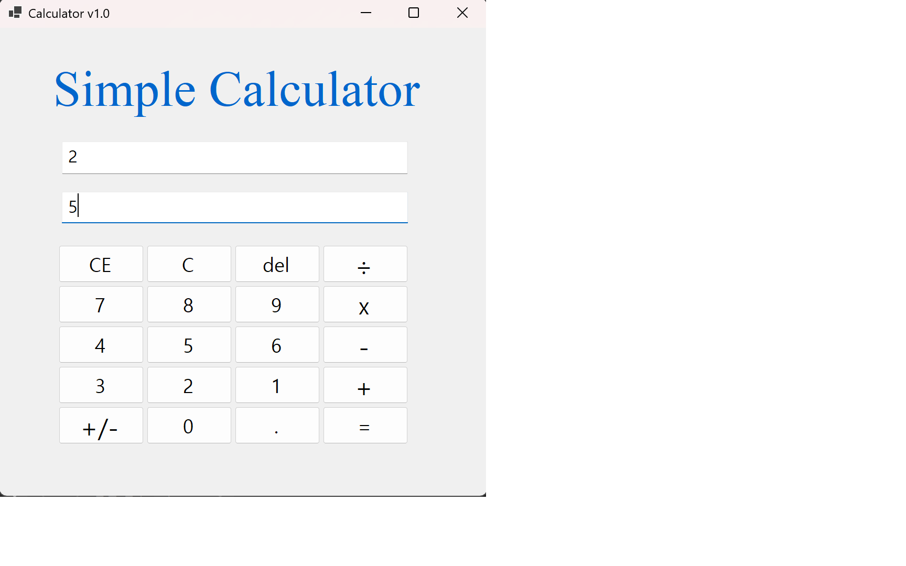
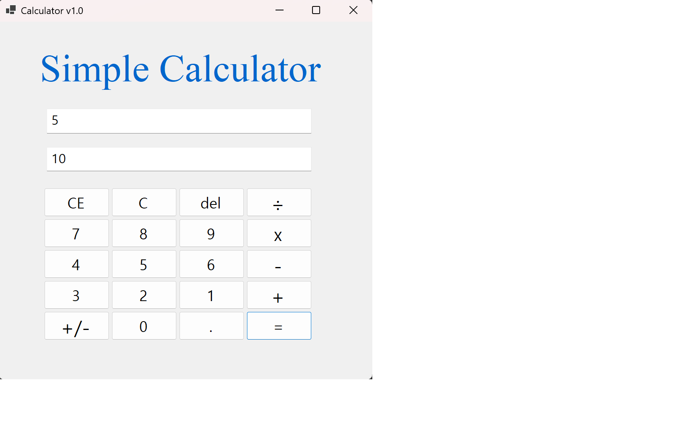
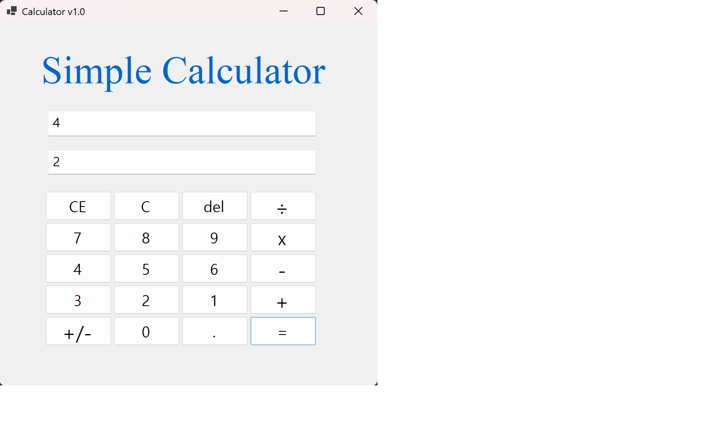
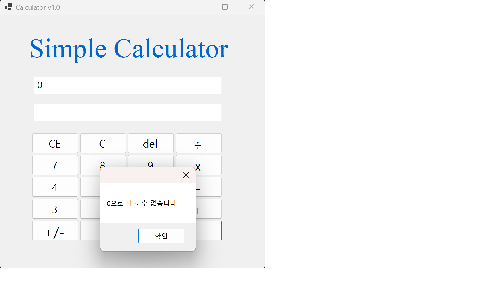

* 과제 내용
  사칙연산 기능 확장

* 구현 내용과 기능 설명
  덧셈 기능을 기반으로 뺄셈, 곱셈, 나눗셈 기능을 추가 구현하였다.
  각 연산 버튼 클릭 시 연산자를 저장하고 입력창을 초기화하도록 구성하였다.
  = 버튼 클릭 시 조건문을 사용하여 선택된 연산에 따라 계산이 수행되도록 구현하였다.
  나눗셈 연산 시 0으로 나누는 경우를 방지하기 위한 예외 처리 기능을 추가하였다.

---

## 실행 화면 (과제3)

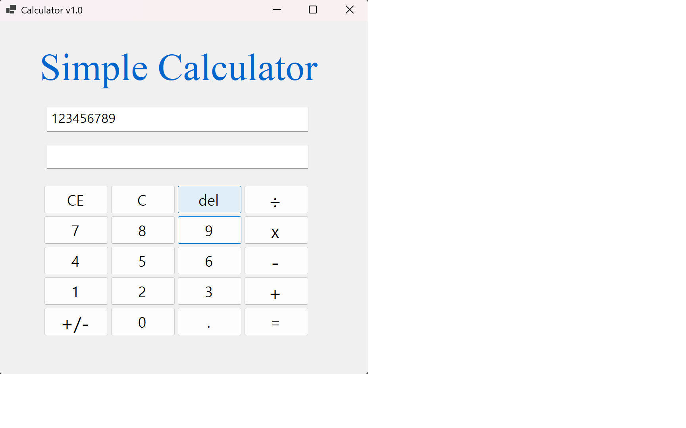
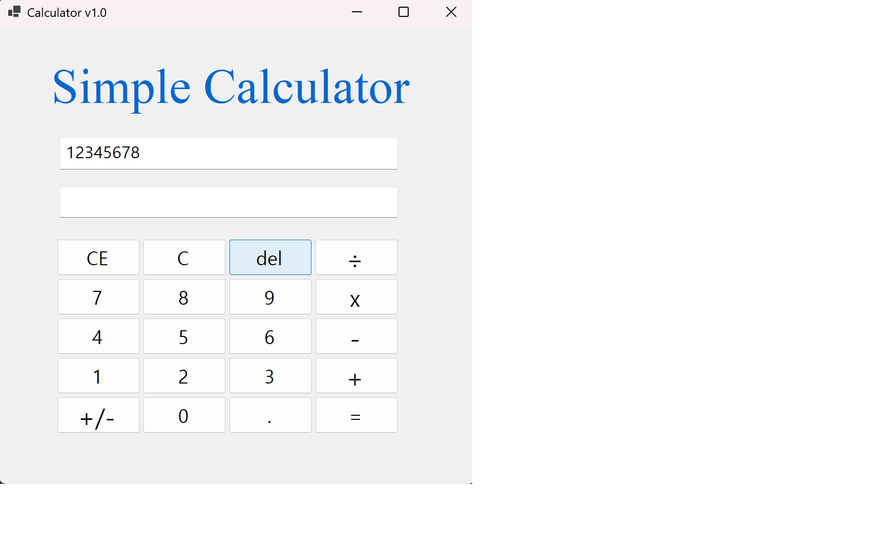
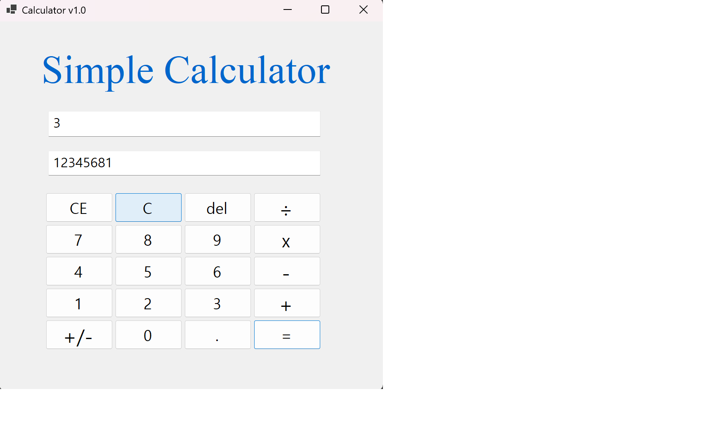
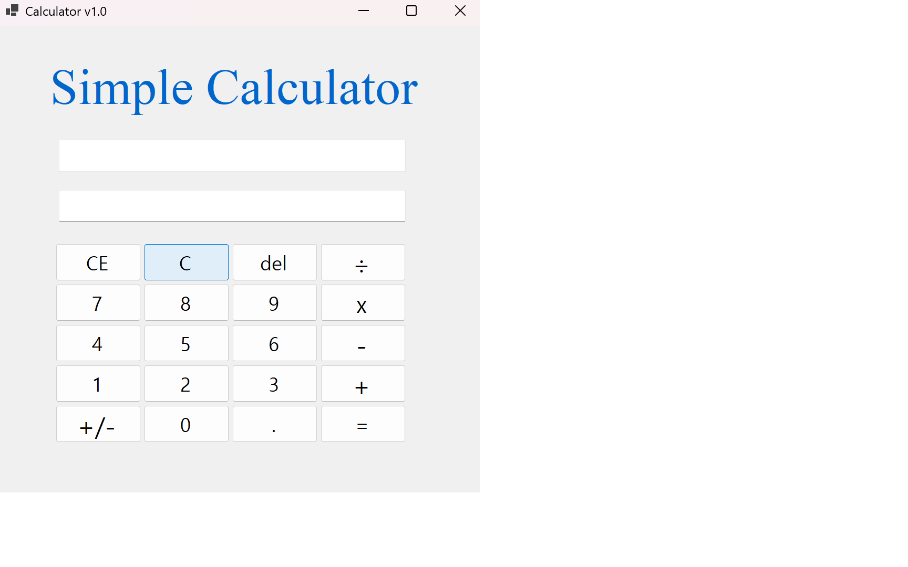
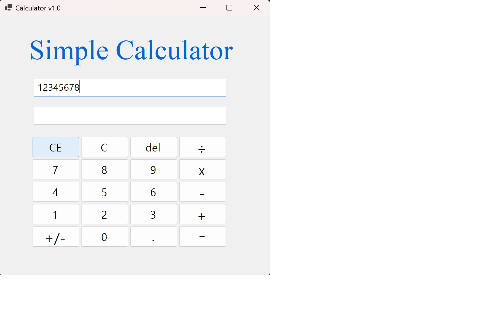
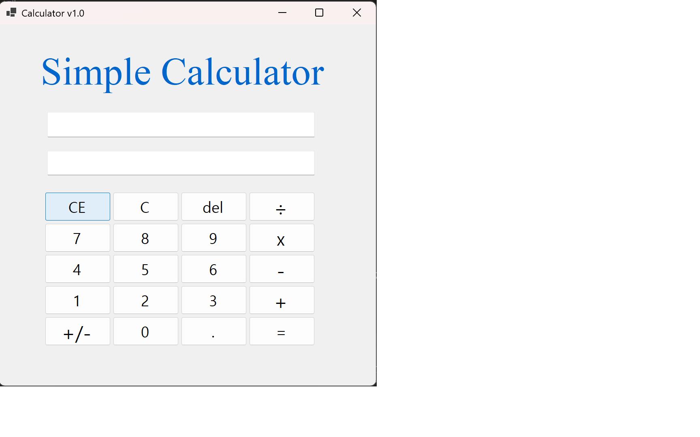
* 과제 내용
  계산기 보조 기능 구현

* 구현 내용과 기능 설명
  C 버튼을 통해 입력값과 결과값을 모두 초기화하도록 구현하였다.
  CE 버튼을 통해 현재 입력 중인 값만 삭제하도록 구현하였다.
  Del 버튼을 통해 입력된 값을 한 글자씩 삭제할 수 있도록 구현하였다.
  버튼 UI 구성 과정에서 1 버튼과 3 버튼의 위치를 수정하여 사용자 편의성을 개선하였다.

---

## 실행 화면 (과제4)

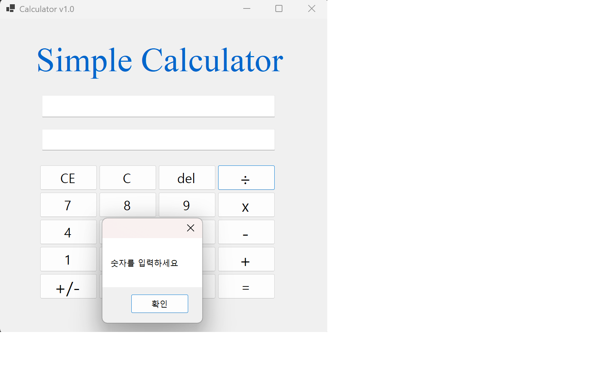
!

* 과제 내용
  사용자 편의 기능 추가

* 구현 내용과 기능 설명
  입력값이 없는 상태에서 연산 버튼을 누를 경우 오류를 방지하고 안내 메시지를 출력하도록 구현하였다.
* 공학용 계산기 기능
  괄호를 사용한 계산을 가능하게 함
---

## 실행 화면 (과제3 보완)

* 과제 내용
  기존 계산 기능의 문제점 개선 및 UI 향상

* 구현 내용과 기능 설명
  입력창에 연산 과정 전체가 표시되지 않던 문제를 수정하여 계산식이 모두 표시되도록 개선하였다. (예: 5+5=10)
  곱셈과 나눗셈 연산 시 각각 ×, ÷ 기호로 표시되도록 변경하여 가독성을 향상시켰다.
  표시용 기호와 계산용 기호를 분리하여 연산 시 발생하던 오류를 해결하였다.
  문자열을 분석하여 피연산자를 분리하고 계산하도록 로직을 개선하였다.
  CE의 기능 오류를 수정하였다.

---

## 배운 내용

* 문자열과 정수 간의 형 변환 과정을 이해하고 활용할 수 있게 되었다.
* 조건문과 변수를 활용하여 사칙연산 로직을 구현하는 방법을 익혔다.
* 이벤트 기반 프로그래밍을 통해 버튼 클릭 이벤트를 처리하는 방법을 학습하였다.
* 사용자 인터페이스 개선을 통해 프로그램의 사용성과 가독성을 향상시키는 방법을 경험하였다.
